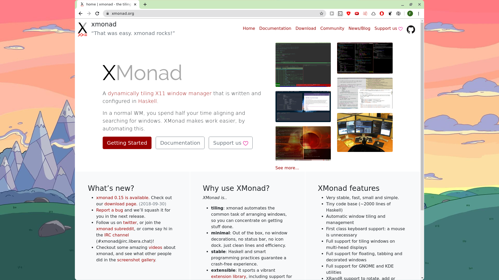
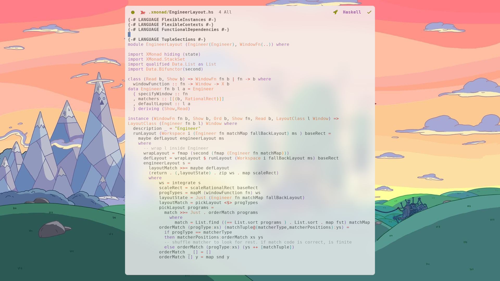
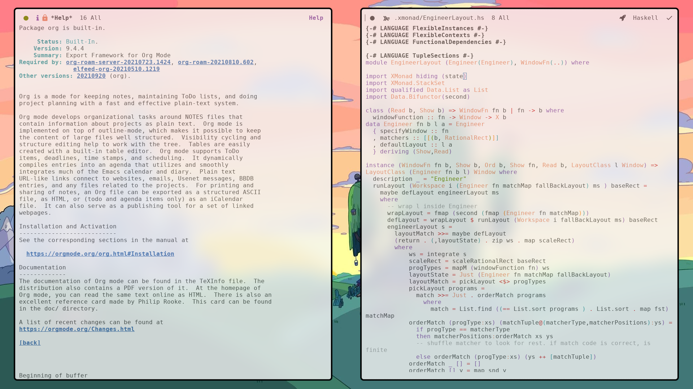
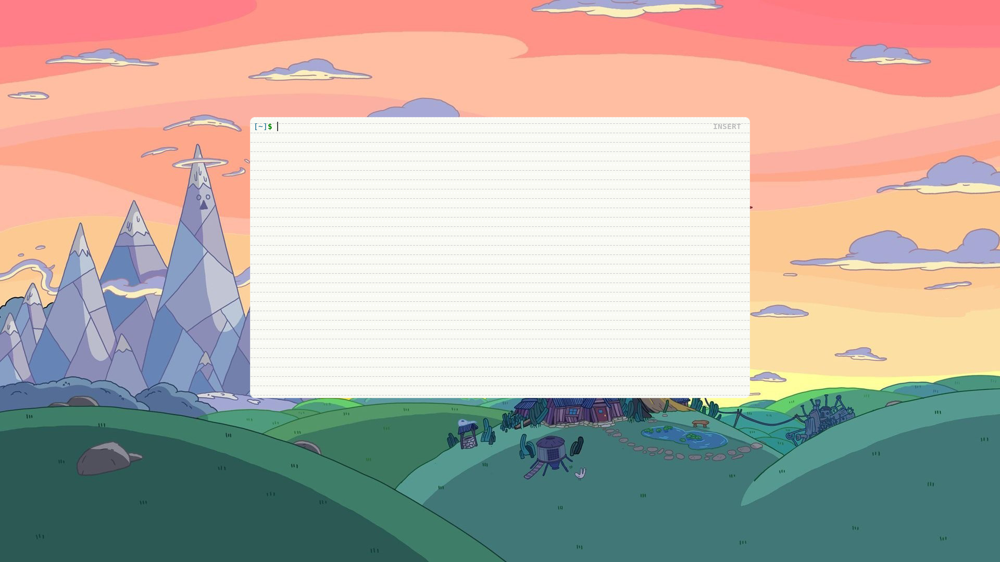

# Engineer Layout
An XMonad layout for fine-grained customisation. It allows you to set pre-defined layouts for when a specific group of windows is present on the workspace. Window categories and how to categorise them is left up to you to define.

## Instalation
Download the [EngineerLayout.hs](./EngineerLayout.hs) file in this repo (or clone everything) and place that file inside your xmonad lib directory (`~.xmonad/lib/`)


## Example config
1. Define the datatype for window categories. It needs to derive `Show` `Ord` `Eq` and `Read`

```haskell
import EngineerLayout

data ProgramType = Discord
                 | Emacs
                 | Browser
                 | Terminal
                 | Other deriving (Show, Ord, Eq, Read)
```

2. Create the `windowFunction`, which has the window categorization logic
- the function type here is `windowFunction MyWindowFn :: (Window) -> X ProgramType)` alter the instance according to your datatype and name `MyWindowFn`whatever you like.
- look [here](https://hackage.haskell.org/package/xmonad-contrib/docs/XMonad-Config-Prime.html) for querying other window properties beyond `appName`
- use `xprop` to find out window properties of the apps you use.
```haskell
data MyWindowFn = MyWindowFn deriving(Show,Read)
instance WindowFn MyWindowFn ProgramType where
  windowFunction _ =
    runQuery (pickProgram <$> appName)
    where
      pickProgram "discord" = Discord
      pickProgram "emacs" = Emacs
      pickProgram "google-chrome" = Browser
      pickProgram "qutebrowser" = Browser
      pickProgram "kitty" = Terminal
      pickProgram _ = Other
```

3. Use the layout, declaring where to place windows in various combinations and at the end, giving a default layout if the categories are different.
```haskell
myLayout = Engineer MyWindowFn
    [ [ (Discord, RationalRect (2%12) (1%12) (8%12) (10%12))]
    , [ (Browser, RationalRect (3%20) 0 (7%10) 1)]
    , [ (Browser,RationalRect (4%10) 0 (6%10) 1)
      , (Discord,RationalRect 0 0 (4%10) 1)
      ]
    , [ (Emacs, RationalRect (3%12) (1%48) (6%12) (46%48))]
    , [ (Emacs, RationalRect (1%50) (1%50) (23%50) (48%50))
      , (Emacs, RationalRect (26%50) (1%50) (23%50) (48%50))
    ]
    , [ (Terminal, RationalRect (3%12) (10%48) (6%12) (24%48))]
    ] (GridRatio 1.5)
```

### Example Result	
#### Browser
```
[ (Browser, RationalRect (3%20) 0 (7%10) 1)]
```

#### Discord
```[ (Discord, RationalRect (2%12) (1%12) (8%12) (10%12))]
```

#### Browser and Discord
```
[ (Browser,RationalRect (4%10) 0 (6%10) 1)
, (Discord,RationalRect 0 0 (4%10) 1)
]
```

#### One Emacs
```
[ (Emacs, RationalRect (3%12) (1%48) (6%12) (46%48))]
```


#### Two Emacs
```
[ (Emacs, RationalRect (1%50) (1%50) (23%50) (48%50))
, (Emacs, RationalRect (26%50) (1%50) (23%50) (48%50))
]
```


#### Terminal
```
[ (Terminal, RationalRect (3%12) (10%48) (6%12) (24%48))]
```


While hot reloading a modified config you need to press mod+shift+space to see changes. This clears the layout state
